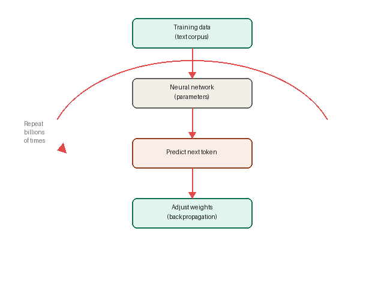

# GenAI and the Developer Landscape

**Module 1 — AI-Assisted Development for Development Teams**

<!-- end_slide -->

## Opening scenario

Your colleague has just pasted your team's internal OpenAPI spec into ChatGPT to get help understanding one of the endpoints.

They got a great explanation. No data was leaked — it's just schema definitions, no real values.

**Type in chat: fine / not fine / depends**

We'll come back to this at the end of the module.

<!-- end_slide -->

## The LLM landscape

Multiple **model families**: GPT-4, Claude, Gemini, Llama...

Multiple **providers**: OpenAI, Anthropic, Google, Meta, Microsoft, open-source

Different **strengths**: code generation, reasoning, long context, speed, cost

<!-- pause -->

**The practical question isn't which is best — it's which fits your task and your data policy.**

<!-- end_slide -->

## Model families at a glance

| Type         | Examples                                        |
|--------------|-------------------------------------------------|
| Generalist   | GPT-4, Claude, Gemini                           |
| Code-focused | GitHub Copilot, Codex, Claude in VS Code      |
| Open / local | Llama, Mistral, Codestral                       |
| Enterprise   | Azure OpenAI, GitHub Copilot for Business, AWS Bedrock |

No single "best" — fit depends on task, data classification, and environment.

<!-- end_slide -->

## Which tool for which job?

- **Daily coding**: VS Code integrations (Copilot, Codex, Claude) or chat
- **Design / architecture**: Models with strong reasoning and long context
- **Sensitive or internal data**: Enterprise / in-tenant instances only
- **Experimentation**: Public chat OK for synthetic examples only

<!-- end_slide -->

## How an LLM is actually trained

<!-- column_layout: [2, 1] -->

<!-- column: 0 -->

<!-- column: 1 -->
A model is not a database. It has no memory of individual facts.

It learned **statistical patterns** across a massive corpus of text — enough to predict what a plausible next token looks like in almost any context.

<!-- pause -->

Two things follow directly from this:
- It can produce fluent, confident output that is **factually wrong**
- The corpus it trained on **shapes everything it knows and assumes**

<!-- end_slide -->

## Your data and the training corpus

When you send a prompt to a public AI tool, that interaction may enter a future training pipeline.

<!-- pause -->

This means:
- Proprietary code you paste could influence outputs **for other users**
- Internal API designs, data schemas, and system descriptions could leak — not as a breach, but as a subtle shaping of what the model "knows"
- There is no way to retrieve or delete data once it has been used for training

<!-- pause -->

**Enterprise tools contractually exclude your data from training.** That is the reason the distinction matters — not just policy, but the mechanics of how these models evolve.

<!-- end_slide -->

## Where hallucination and bias come from

Both are properties of the training process, not bugs to be patched.

**Hallucination** happens because the model is optimised to produce *plausible* output, not *true* output. It has no mechanism to distinguish between "I know this" and "this sounds right."

<!-- pause -->

**Bias** happens because the corpus was not a neutral sample of human knowledge. It over-represented some voices, languages, and perspectives — and the model reflects that, whether you can see it or not.

<!-- pause -->

Neither will be "fixed." They are managed — through verification, grounding, and knowing when not to trust the output.

<!-- end_slide -->

## The critical distinction: public vs. enterprise

When you send data to a public AI tool, **the provider's policy governs it** — not yours.

| | Public (e.g. ChatGPT free) | Enterprise (e.g. Copilot for Business) |
|--|--|--|
| Data handling | Provider policy | Your tenant / contract |
| Used for training | Often permitted | Typically excluded |
| Internal docs | Do not send | When policy allows |
| Proprietary code | Do not paste | Per governance |

<!-- pause -->

**What you send and where it is processed determines risk.**

<!-- end_slide -->

## Quick classification — type in chat

Where does each one belong? **P** = public AI fine, **E** = enterprise only, **N** = no AI

<!-- incremental_lists: true -->
1. A regex to validate a UK postcode format
2. The connection string logic for your production database
3. An internal REST API's OpenAPI spec (no real data, just schema)
4. A unit test for a public-facing DTO

<!-- end_slide -->

## Cut-offs and verification

One more limitation: the training corpus has a **fixed end date**.

- "What's new in FastAPI 0.120?" may be incomplete, wrong, or missing entirely
- Library versions, package APIs, and security advisories go stale fast

<!-- pause -->

**Practical rule:** anything with a version number gets verified against the official docs before it goes into production.

<!-- end_slide -->

## Trust but verify

| Rely on (with light check) | Double-check or avoid |
|----------------------------|-----------------------|
| Syntax and style | Security and auth logic |
| Well-documented public APIs | Internal / proprietary APIs |
| Refactors with tests | Legal / compliance wording |
| Explanations of your code | Facts, figures, versions |

<!-- end_slide -->

## Back to the opening scenario

Your colleague pasted the internal OpenAPI spec into ChatGPT.

**Was it fine?**

<!-- pause -->

The spec contained no real data — but it revealed endpoint paths, request/response schemas, and internal data models.

That is proprietary system architecture. Public AI tools may retain it. It goes into a provider you don't control.

<!-- pause -->

**Rule of thumb**: when in doubt about whether something is proprietary, use enterprise AI or don't send.

<!-- end_slide -->

## Addressing the room honestly

Some of you are strong advocates. Some are sceptical — AI as cheating, or a threat to the job.

<!-- pause -->

Good work still matters. AI changes **what** good work looks like: more review, clearer specs, faster iteration on boilerplate — not whether your judgment is needed.

<!-- pause -->

**For BAs:** You're here for context, not to become prompt engineers. Understanding tools and limits helps you partner with developers who use them daily.

<!-- end_slide -->

## Summary

1. **Landscape**: Many models and providers — choose by task and data policy
2. **Privacy**: Public vs. enterprise is non-negotiable; keep internal data in-house
3. **Limitations**: Hallucinations, cut-offs, bias — verify critical output
4. **Practice**: Trust but verify; know when to rely and when to escalate

<!-- end_slide -->

## Bridge to Module 2

**We've established:**
- Where to use AI (public vs. enterprise)
- When to trust vs. verify

**Module 2**: Core prompt engineering — *how* to prompt effectively

Clarity, context, constraints, iterative refinement.

The safety principles from Module 1 apply throughout the course.

<!-- end_slide -->

# Questions?

*Module 1 — GenAI and the Developer Landscape*